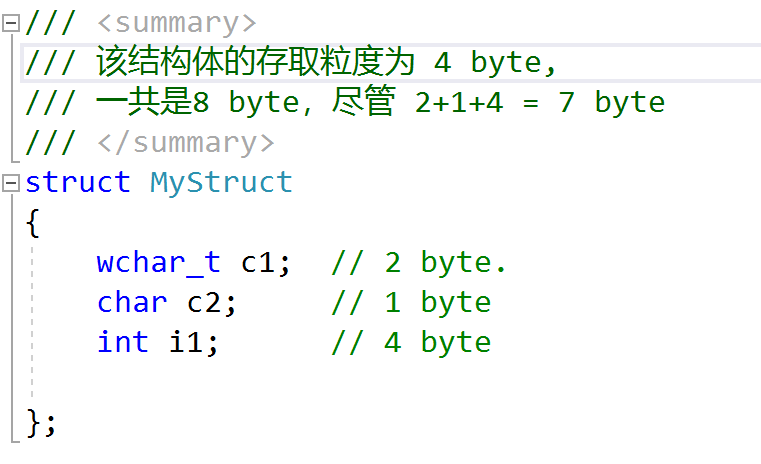

## :books: 一、数据结构与算法(LeetCode刷题)
1. 求两个字符串的公共子串最大长度
2. 最大连续子数组
3. 最长不重复子串，超过两个不算重复
4. 稳定的排序算法有哪些
5. 寻找树的深度
6. 删除链表中的重复节点
7. 判断链表中是否有环
8. 链表反转
9. 二叉树中序遍历
10. 二叉树层序遍历
11. 大小为n的数组中找n-1个数的最大积
12. 数组中第k大的数
13. 贪心和动态规划的区别
14. 旋转的排序数组中找最小值

## :computer: 二、操作系统
1. 进程和线程的概念及区别 :star::star::star::star:
   >（1）、进程是系统资源分配的基本单位，线程是独立调度的基本单位。一个进程可以包含多个线程，它们共享进程资源，但是它们不拥有资源。
   （2）、同一进程中，线程切换不会引起进程切换；不同进程中，线程的切换会引起进程的切换。
   （3）、进程的切换涉及到系统资源的分配和撤回，需要较大的开销；而线程的切换，则只需要保存和设置少量的寄存器内容，开销较小。
   （4）、线程间可以通过直接读取同一进程中的数据来进行通信，但是进程间的通信需要借助IPC。
2. 线程的调度算法
3. 多线程要注意哪些事项：
   > 1. 线程同步：多线程中对一些共享资源的访问要注意数据的一致性
   > 2. 线程调度：要考虑各个线程的优先级，以及每个线程都能获得合理的CPU使用时间 。
   > 3. 避免死锁问题
   > 4. 内存管理： 注意线程所申请的内存的释放，避免造成内存泄漏
   > 5. 上下文切换所带来的开销：尽量减少频繁的上下文切换，影响程序的性能
   
4. 两个进程要通信，有哪些方式，什么样的方式最快？ :star::star::star::star:
5. 父进程使用malloc得到一块内存，子进程可以使用吗？
6. 进程使用malloc分配一块M的内存，是马上就得到这块内存了吗？
7. 有一个进程突然卡死了，你是怎么定位这个问题的？
8. 某一个线程占用很大的内存，怎么解决？
9.  死锁如何检测？假如带有死锁的代码已经上线，怎么定位？
10. I/O多路复用
11. 线程间同步、互斥
12. 线程模型？
13. 操作系统锁有哪些？
14. 程序编译需要的四个阶段：预处理-->编译-->汇编-->链接

## :rocket: 三、编程语言 C++
1. 基本数据类型、字节数、表示范围
2. strcpy、sprintf 与 memcpy 的区别
   > 三者主要有以下不同之处： （1） 操作对象不同，strcpy 的两个操作对象均为字符串，sprintf 的操作源对象可以是多种数据类型，目的操作对象是字符串，memcpy 的两个对象就是两个任意可操作的内存地址，并不限于何种数据类型。 （2） 执行效率不同，memcpy 最高，strcpy 次之，sprintf 的效率最低。 （3） 实现功能不同，strcpy 主要实现字符串变量间的拷贝，sprintf 主要实现其他数据类型格式到字符串的转化，memcpy 主要是内存块间的拷贝。 说明：strcpy、sprintf 与 memcpy 都可以实现拷贝的功能，但是针对的对象不同，根据实际需求，来选择合适的函数实现拷贝功能。 
3. lambda函数
4. c++11特性
5. 常用stl，选取一个讲讲有哪些方法函数
6. map底层
7. 无序map容器
8. 手写降序数组二分查找
9.  vector的内存扩容怎么做的？为什么是2倍？
10. 数据转换类型，如：static_cast和dynamic_cast
11. 哈希表的实现、解决哈希冲突
12. static用法、生命期
13. C和C++的区别
14. hash表的底层实现？
15. C++的右值引用，左值问题
      > 在C++11中所有的值必属于左值、右值两者之一，右值又可以细分为纯右值、将亡值。可以取地址的、有名字的就是左值，反之，不能取地址的、没有名字的就是右值（将亡值或纯右值）。举个例子，int a = b+c, a 就是左值，其有变量名为a，通过&a可以获取该变量的地址；表达式b+c、函数int func()的返回值是右值，在其被赋值给某一变量前，我们不能通过变量名找到它，＆(b+c)这样的操作则不会通过编译。
16.  指针引用区别
17.  new和malloc区别
18.  map和hashmap的区别
19.  虚函数怎么调用的
20.  子类想在构造函数中调用自己的虚函数，怎么办
21.  结构体定义一个引用，结构体大小
22.  宏（#define）和内联函数（inline）的理解以及区别
23.  C++的顶层const和底层const
24.  final和override关键字
25.  C++中的重载和重写的区别
26.  C++内存管理，内存池技术（热门问题）
27.  C++多态的实现
28.  虚函数实现机制，C++的虚函数介绍
29.  虚函数作用
30.  C++中类的数据成员和成员函数内存分布情况
31.  析构函数一般写成虚函数的原因，析构函数一定要是虚函数吗
32.  构造函数可以是虚函数吗，构造函数或者析构函数中调用虚函数会怎样
33.  静态类型和动态类型，静态绑定和动态绑定怎么实现
34.  引用是否能实现动态绑定，为什么引用可以实现
35.  深拷贝和浅拷贝的区别（举例说明深拷贝的安全性）
36.  什么情况下会调用拷贝构造函数（三种情况）
37.  C++的四种强制转换
38.  C++的异常处理
39.  decltype()和auto
40.  初始化与赋值的区别
41.  STL知道哪些，哪些结构是用哈希实现的
42.  哈希冲突怎么解决（拉链法和探测法）
43.  Map和unordered_map用什么实现，插入和查询的复杂度多少
44.  C++如何实现多线程
45.  C++结构体和联合体什么区别
46.  智能指针的实现（手写代码）
47.  shared_ptr,unique_ptr的类实现
48.  sizeof 和 strlen区别
49.  C/C++程序编译的整个过程
      > 1. **预处理**: 扩展源代码，插入所有 #include 命令指定的文件，并扩展所有 #define声明指定的宏。
      > 2. **编译**： 将源文件编译成汇编代码
      > 3. **汇编**： 将汇编代码转换成二进制目标代码文件
      > 3. **链接**： 将二进制目标代码文件与库函数进行连接，生成最终的可执行文件。
50.   结构体字节对齐？内存对齐
      > 就是以结构体中，数据类型所占的字节数最大的值作为内存存取的粒度，如果遇到不够的，就会进行补齐。如：
      
51.  C++多态以及如何实现
52.  C++常用的设计模式，手写单例模式，了解其他设计模式
53.  内存溢出和内存泄露
54.  C++内存模型，每个区放什么
55.  const和#define的区别
     >**宏定义#define:** 相当于字符替换，预处理器处理， 没有类型安全检查，不分配内存，存储在代码段，可以通过`#undef`取消 。
     **const:** 声明常量，编译器处理，有类型安全检查，分配内存，存储在数据段，不可以取消。
56.  allocator c++的实现
57.  C++怎么检测内存泄露，怎么定位内存泄露？假如内存泄漏的代码已经上线，如何定位？
58.  虚函数的作用及底层实现原理
59.  构造函数可以是虚函数吗？析构函数为什么建议是虚函数？
     > 1. 构造函数不可以是虚函数。虚函数是一种只需要知道部分信息就能完成对应工作的机制。在实际应用中，virtual允许我们在只知道接口类型，而不知道对象的具体类型时来调用对应的函数。但是在调用构造函数来创建实例对象时是需要知道完成的确定的信息，而不是部分信息。且==调用构造函数时，虚表指针并没有在对象的内存空间中，必须要构造函数调用完成后才会形成虚表指针==【虚函数是用来实现动态多态的，而实现动态多态的方式是通过基类指针或引用来调用派生类的虚函数，从而实现动态多态。因此前提是需要先创建对象，而如果构造函数为虚函数，则会无法创建对象】。
     > 2. 析构函数可以为虚函数，且一般建议为虚函数。因为对于派生类来说，如果析构函数为虚函数，在释放new 的对象时，可以将依次将基类和派生类的内存都释放，否则可能只会释放基类的对象，而导致内存泄漏。
60.  说一下STL常见容器及内部实现的数据结构
61.  使用vector如何避免频繁的内存重新分配？map和 unordered_map的区别？哈希表如何解决键值冲突？
62.  多线程同步的方式有哪些？

## :globe_with_meridians: 四、计算机网络
1. TCP三次握手过程？四次挥手过程？time_wait的作用？时间是多长？
2. HTTP请求报文都有什么？HTTP的请求方法有什么？PUT和POST有什么区别？
3. tcp三次握手四次挥手，TIME_WAIT的2msl及两个作用，以及tcp为什么可靠
4. TIME_WAIT和CLOSE_WAIT的区别？
5. Socket编程主要大的步骤
6. socket编程中read失败可能的原因有哪些
   >1. 连接断开
   >2. 超时
   >3. 接受缓冲区满了：用来接收数据的缓冲区满了
   >4. 其它各种问题，如网络故障，资源限制，软件Bug等。
   > read函数的返回值，可能为大于0：表示读取的字节数；等于 0 表示对方已经关闭了socket；等于-1，此时要查看 errno, 来判断具体的原因，常见的有EINTR 表示当前系统中断，EAGAIN 或 EWOULDBLOCK 可能是非阻塞socket暂时未读到数据。
  
7. 讲TCP和UDP的协议的区别
8. TCP如何保证可靠性传输？
9.  TCP的四个定时器？
10. TCP粘包问题？
11. ARP是什么？协议是怎么实现的？
12. ARP是怎么找到MAC地址的？
13. 发送数据时阻塞和非阻塞的区别？
14. https建立连接过程
15. SSL具体实现？

## :floppy_disk: 五、数据库
1. 事务的隔离级别
2. mysql的引擎都有什么？ 各自的特点？
3. MySQL数据库索引用的什么数据结构，为什么用B+数树不用别的
4. MySQL索引数据结构

## :penguin: 六、Linux相关
1. 常考命令： top、free、df、netstat、ps
2. poll，epoll，select区别
3. Linux中过滤掉文本的命令
4. 如何查看耗时最大的函数？使用什么工具？
5. linux查看系统资源和进程资源使用情况
6. 杀死一个进程怎么操作
7. 有哪些进程杀不死
8. 僵尸进程怎么杀死
9. 

## :cat: 七、git 相关
1. 讲一下git的具体特点，pull和fetch的区别.
2. 讲一下git和svn的区别.

## :bulb: 八、软件开发
1. 软件开发流程
2. 常见设计模式

## :mag: 其他方面
1. 你认为你跟别人相比你的优势是什么？
2. 个人优缺点，举几个例子
3. 你最近在看什么书？看完的书都有哪些？
4. 你平时都是怎么学习的？
5. 项目简介、难点
6. 从项目经历中学到了什么
7. 最有成就感的事
8. 烧木棍问题，很多长短质地不均匀的木棍，每根烧完都要60min，问如何计时45min
9. 你觉得你做的模块在整个项目中的价值占比多少？
10. 你平时有看开源的项目吗？
11. 你在工作中有遇到什么技术难点吗？

 

