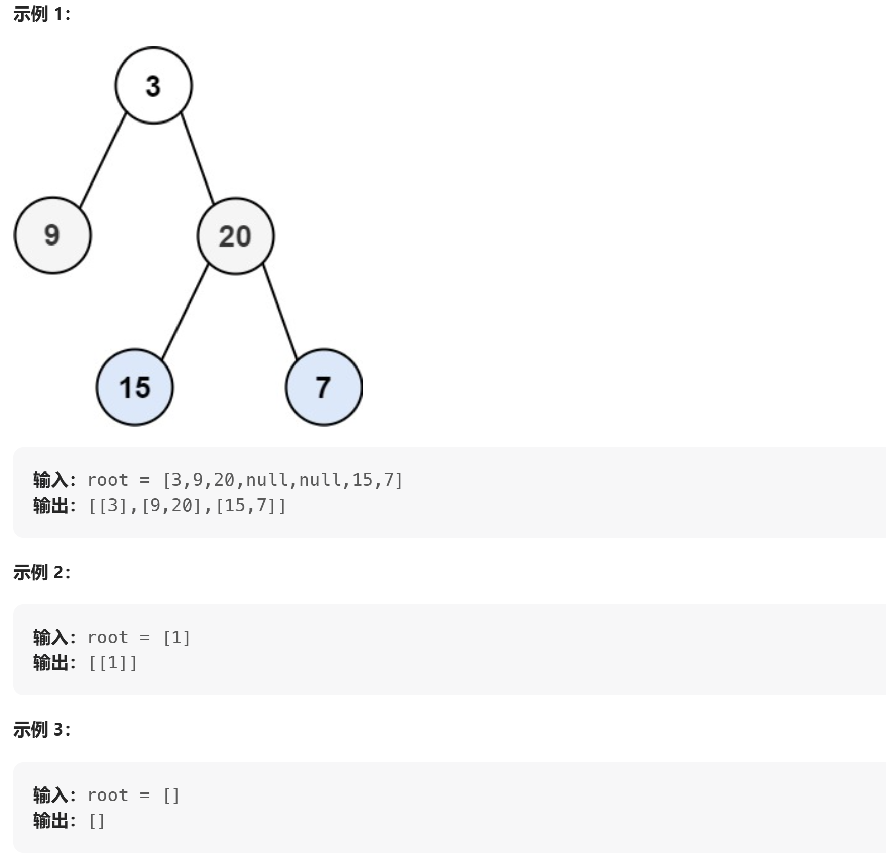

[LeetCode:二叉树的层序遍历](https://leetcode.cn/problems/binary-tree-level-order-traversal/description/)

给你二叉树的根节点 root ，返回其节点值的 层序遍历 。 （即逐层地，从左到右访问所有节点）。



---
[解析](https://programmercarl.com/0102.%E4%BA%8C%E5%8F%89%E6%A0%91%E7%9A%84%E5%B1%82%E5%BA%8F%E9%81%8D%E5%8E%86.html)

层序遍历主要是借助到队列，首先将一层的所有节点放入队列中，然后再弹出队列中的数据的同时，来将其对应的左右子节点放入到队列中。需要注意每一层需要弹出的节点个数是多少，可以使用`for`，也可以使用`while`来处理

**方法1**：使用 while

```cpp
vector<vector<int>> levelOrder(TreeNode* root)
{
    queue<TreeNode*> queTree;
    vector<vector<int>> res;

    if (root == NULL)
        return res;

    queTree.push(root);
    int cnt = 1; // 每一层的节点个数

    while (!queTree.empty())
    {
        vector<int> tmp;
        int nextNum = 0; //下一层节点的个数
        
        while (cnt--)
        {
            TreeNode* curNode = queTree.front();
            queTree.pop();

            tmp.push_back(curNode->val);

            if (curNode->left != NULL)
            {
                queTree.push(curNode->left);
                nextNum++;
            }

            if (curNode->right != NULL)
            {
                queTree.push(curNode->right);
                nextNum++;
            }
            

        }

        res.push_back(tmp);
        cnt = nextNum;

    }

    return res;

}
```

**方法2**: 使用for
```cpp
vector<vector<int>> levelOrder(TreeNode* root)
{
    queue<TreeNode*> queTree;
    vector<vector<int>> res;

    if (root == NULL)
        return res;

    queTree.push(root);

    while (!queTree.empty())
    {
        vector<int> tmp;
        int len = queTree.size();

        for (int i = 0; i < len; i++)
        {
            TreeNode* curNode = queTree.front();
            queTree.pop();

            tmp.push_back(curNode->val);

            if (curNode->left != NULL)
                queTree.push(curNode->left);

            if (curNode->right != NULL)
                queTree.push(curNode->right);

        }

        res.push_back(tmp);

    }

    return res;

}

```


