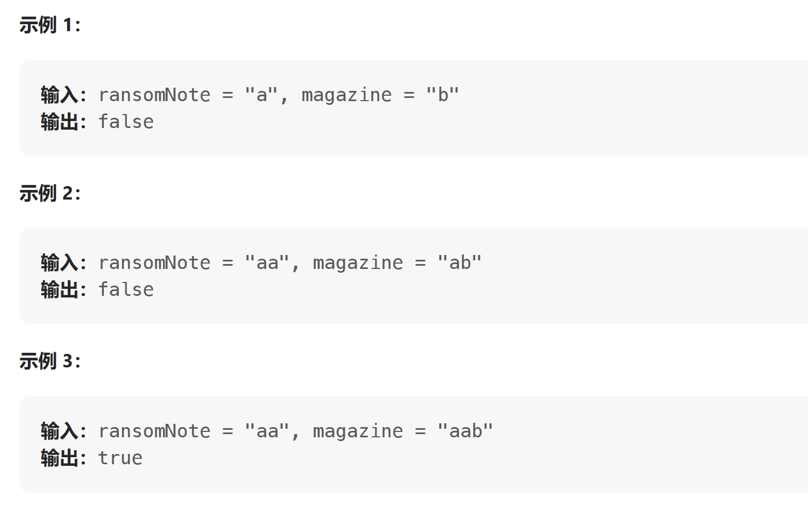

[LeetCode: 赎金信](https://leetcode.cn/problems/ransom-note/description/)

给你两个字符串：`ransomNote` 和 `magazine` ，判断 `ransomNote` 能不能由 `magazine` 里面的字符构成。

如果可以，返回 true ；否则返回 false 。

`magazine` 中的每个字符只能在 `ransomNote` 中使用一次。

注：`ransomNote` 和 `magazine` 由小写英文字母组成



---
[解析](https://programmercarl.com/0383.%E8%B5%8E%E9%87%91%E4%BF%A1.html#%E6%80%9D%E8%B7%AF)
本题可以先将原始字串的字符和每个字符出现的次数放在对应的`unordered_map`中，然后再遍历目标字串，将每个字符在哈希表中查找，并减少其对应的次数。如果没有找到，或者次数少于0 ，则表示不符合条件。

==**方案一**==：使用 `unordered_map` 
```cpp
bool canConstruct(string ransomNote, string magazine)
{
    unordered_map<char, int> unmap;

    // 将magazine中的字符以及其出现的次数放在map中
    for (char i : magazine)
    {
        unmap[i]++;
    }

    //遍历ransomNote，在map中去查找每个字符是否存在，以及其使用的次数是否小于0
    // 若小于0，则表示该字符已经用完，否则就递减一次
    for (auto j : ransomNote)
    {
        if (unmap.find(j) != unmap.end() && unmap[j] != 0)
        {
            unmap[j]--;
        }
        else
        {
            return false;
        }
    }

    return true;

}
```


==**方案二**==：由于两个字串中都只有小写字符，因此可以使用内存跟时间更少的数组来代替map
```cpp
bool canConstruct(string ransomNote, string magazine)
{
    // 由于字串中都是小写字符，所以其全部使用的字符空间就是26个
    // 因此使用大小为26的数组会比 unordered_map更加节约空间和时间
    int arr[26] = { 0 };
    for (char i : magazine)
        arr[i - 'a']++;

    for (char j : ransomNote)
    {
        arr[j - 'a']--;

        if (arr[j - 'a'] < 0)
            return false;
    }

    return true;
}
```


