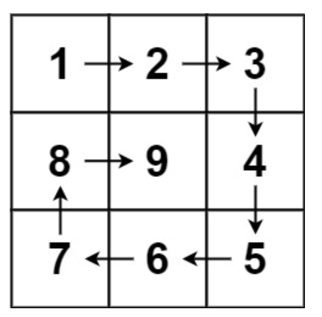

[LeetCode: 螺旋矩阵 II](https://leetcode.cn/problems/spiral-matrix-ii/description/)

给你一个正整数 n ，生成一个包含 1 到 $n^2$ 所有元素，且元素按顺时针顺序螺旋排列的 n x n 正方形矩阵 matrix 。

**示例**

>输入：n = 3
输出：[ [1,2,3], [8,9,4], [7,6,5] ]




---

【解析】
通过循环来进行填充：

```cpp
vector<vector<int>> generateMatrix(int n)
{
    // 定义一个 n*n 的二维数组，用来存放对应的螺旋矩阵，并将其值初始化为 0
    vector<vector<int>> matrix(n, vector<int>(n, 0));

    //每次循环的起始坐标点
    int startX = 0, startY = 0;
    //可以进行的循环次数，即每次循环为一整个环，上右下左 四条边，当loop为奇数时，需要特殊处理中间的值
    int loop = n / 2;
    //用于填充螺旋矩阵的数值
    int val = 1;
    //当n为奇数时，其表示的中间位置的坐标
    int mid = n / 2;
    //用来控制每条边的长度，遵循左闭右开[)的规则，每循环一次，每条边的长度就会减少1
    int offset = 1;
    int i, j;

    // 每次循环填充四条边，遵循左闭右开原则(即一条边中填充数字小的位置为闭，数字大的位置为开)，循环次数为loop
    while (loop--)
    {
        i = startX;
        j = startY;

        // 本次循环最上面一行的数值，从左向右填充数值
        for (; j < n - offset; j++) 
        {
            matrix[i][j] = val++;
        }

        // 本次循环最右列的数值，从上向下填充数值
        for (; i < n - offset; i++) 
        {
            matrix[i][j] = val++;
        }

        // 本次循环最下一行，从右向左填充数值
        for (; j > startY; j--)
        {
            matrix[i][j] = val++;
        }

        // 本次循环的最左列，从下往上填充数值
        for (; i > startX; i--)
        {
            matrix[i][j] = val++;
        }

        //每次循环后，下次循环的每条边长度将减1
        offset++;
        //下一次的起始位置将递增1，如: (0,0), (1,1), (2,2), ......
        startX++;
        startY++;

    }

    // 当n为奇数时，其中间会剩下一个元素，需要特殊处理一下。
    if (n % 2 != 0)
    {
        matrix[mid][mid] = val++;
    }


    return matrix;
}
```


