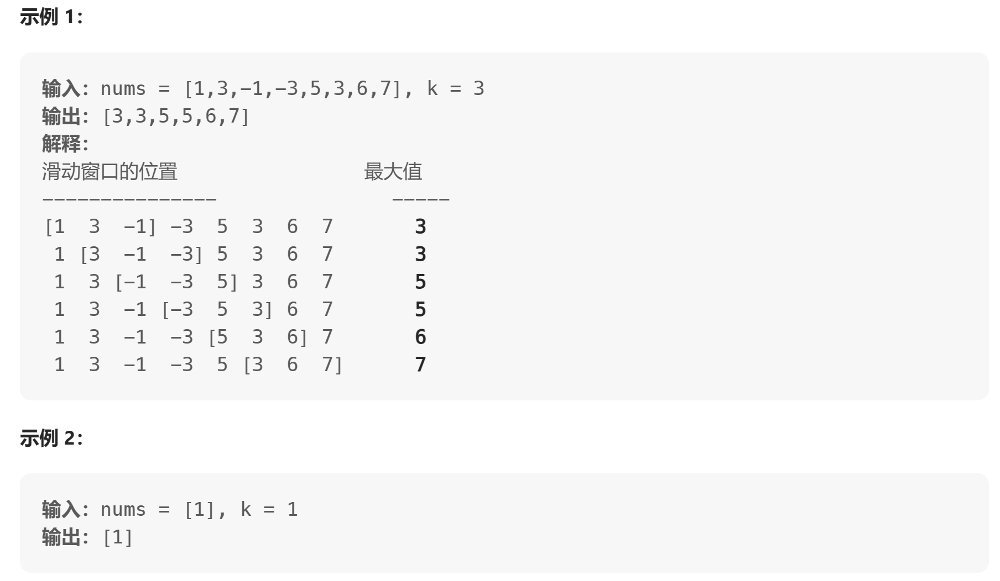

[LeetCode: 滑动窗口最大值](https://leetcode.cn/problems/sliding-window-maximum/description/)

给你一个整数数组 nums，有一个大小为 k 的滑动窗口从数组的最左侧移动到数组的最右侧。你只可以看到在滑动窗口内的 k 个数字。滑动窗口每次只向右移动一位。

返回 滑动窗口中的最大值 。




----
[解析](https://programmercarl.com/0239.%E6%BB%91%E5%8A%A8%E7%AA%97%E5%8F%A3%E6%9C%80%E5%A4%A7%E5%80%BC.html)

本题可以通过维护一个自定义的单调递减队列来实现，自定义的队列的底层通过 `deque` 来实现对应的功能。
- `push`来向单调队列的末尾插入数据，在插入数据之前会先对比队列末尾的数值与即将要插入的数值的大小，如果队列末尾数值小于即将要插入的数值，就将队列末尾的数值先删除，直到末尾的数值大于即将要插入的数值为止。这样可以保证队列中的数值为单调递减。
- `pop`由于队列中并不是维护一个滑动窗口中的所有数值，只是维护其中有可能的最大值，所以队列中的数值可能小于滑动窗口中的数值，所以每次在删除队列首部元素的时候要先对比一下要删除的值是否为队列首部的值，只有相等时，才会删除
- `front`为当队列首部的元素，也是对应的当前滑窗中的最大值

```cpp
/// <summary>
/// 自定义的队列来实现pop,push,front等功能
/// </summary>
class MyQueue 
{

private:
    deque<int> myque;

public:
    void pop(int val)
    {
        //删除元素之前先比较队列首元素是否等于要删除的值
        if (!myque.empty() && myque.front() == val)
            myque.pop_front();
    }

    void push(int val)
    {
        //在向队列尾部插入新元素之前要比较当前的值与队列末尾的元素大小，
        //如果队列末尾的元素小于即将插入的值，则要将队列末尾的元素先删除,
        //直到末尾的元素大于或等于即将要插入的值为止。这样才能满足单调递减队列
        while (!myque.empty() && myque.back() < val)
            myque.pop_back();

        myque.push_back(val);

    }


    int front()
    {
        return myque.front();
    }

};


vector<int> maxSlidingWindow(vector<int>& nums, int k)
{
    vector<int> res;

    MyQueue myque;

    for (int i = 0; i < nums.size() && i<k; i++)
    {
        myque.push(nums[i]);
    }
    res.push_back(myque.front());

    for (int j = 1; j < nums.size() - k + 1; j++)
    {
        //在滑动窗口的时候先要将当前滑窗的首元素先删除
        myque.pop(nums[j-1]);
        //再将滑窗后面的一个新元素插入
        myque.push(nums[j+k-1]);

        res.push_back(myque.front());
    }

    return res;

}
```


