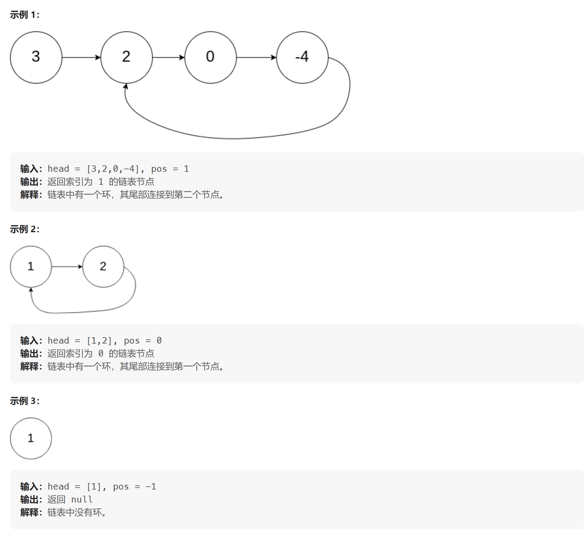

[环形链表 II](https://leetcode.cn/problems/linked-list-cycle-ii/description/)

给定一个链表的头节点  head ，返回链表开始入环的第一个节点。 如果链表无环，则返回 null。

如果链表中有某个节点，可以通过连续跟踪 next 指针再次到达，则链表中存在环。 为了表示给定链表中的环，评测系统内部使用整数 pos 来表示链表尾连接到链表中的位置（索引从 0 开始）。如果 pos 是 -1，则在该链表中没有环。注意：pos 不作为参数进行传递，仅仅是为了标识链表的实际情况。



----
[参考解析](https://programmercarl.com/0142.%E7%8E%AF%E5%BD%A2%E9%93%BE%E8%A1%A8II.html#%E6%80%9D%E8%B7%AF)
环形链表的入口节点中重要的两点：
1. **判断是否有环**：通过快慢指针的方式，快指针一次移动两步，慢指针一次移动一步。若有环，则快慢指针一定会相遇；若没有环，则快指针一定会先到达末尾节点。
2. **判断环的入口节点**：若存在环，此时需要进一步判断环的入口节点。通过连个指针的方式，一个指针指向头节点，一个指针指向相遇的节点。最后两个指针再相遇的位置一定是环的入口点。


```cpp
ListNode* detectCycle(ListNode* head)
{
    if (head == NULL)
        return NULL;

    ListNode* fast = head;
    ListNode* slow = head;

    //通过快慢指针来找到相遇点的位置，由于快指针要每次走两步，因此要
    //同时判断fast和fast->next是否为NULL，因为存在fast=NULL，而此时再取fast->next会报错
    while (fast != NULL && fast->next != NULL)
    {
        fast = fast->next->next;
        slow = slow->next;

        if (slow == fast)
        {
            // 存在环的情况下：一个指针在头节点，一个指针在相遇点，此时两个指针每次都走一步，则必定在入口处相遇
            ListNode* index1 = head;
            ListNode* index2 = fast;

            while (index1 != index2)
            {
                index1 = index1->next;
                index2 = index2->next;
            }

            return index1;
        }
    }

    return NULL;

}
```


