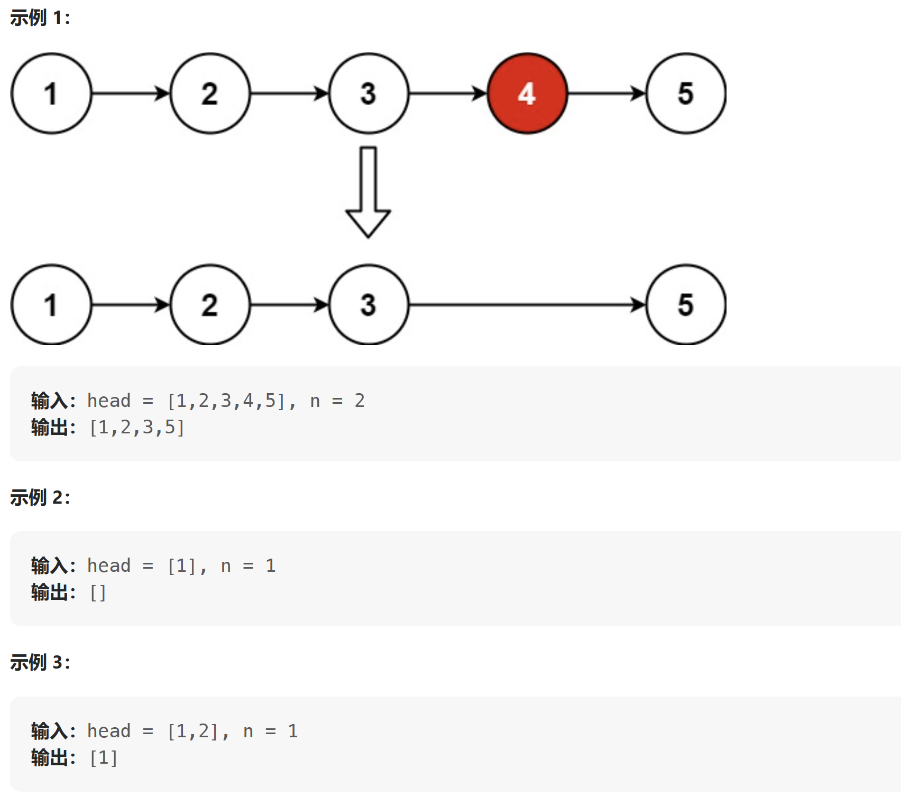

[LeetCode：删除链表的倒数第 N 个结点](https://leetcode.cn/problems/remove-nth-node-from-end-of-list/description/)

给你一个链表，删除链表的倒数第 n 个结点，并且返回链表的头结点。只遍历一次来进行操作



---
解析：
对于这种删除倒数第n个节点的链表，且只进行一次遍历，则一般使用双指针的方式，两个指针之间相差n个节点
首先是快指针先走n步，然后慢指针再开始走，当快指针到达末尾的时候，则慢指针刚好指向要删除的节点。但是
由于要删除倒数第n个节点时，则必须要将慢指针指向倒数第n+1个节点，即第n个节点的前一个节点。

```cpp
/// <summary>
/// 使用快慢的双指针方式来进行一次遍历，然后删除倒数第n个节点，
/// 慢指针和快指针之间相差n个节点。
/// </summary>
ListNode* removeNthFromEnd(ListNode* head, int n)
{
    //创建虚拟的首节点，来避免处理首节点的特殊逻辑，从而简化整个流程
    ListNode* dummyNode = new ListNode(0);
    dummyNode->next = head;

    ListNode* fast = dummyNode;
    ListNode* slow = NULL;

    int cnt = 0;
    while (fast->next != NULL) //判断快指针是否到底最后一个节点
    {
        cnt++;
        fast = fast->next;
        if (slow != NULL)
            slow = slow->next;
        

        // 快指针和慢指针之间相差n+1个节点，因为慢指针要指向倒数第n个
        // 节点前面的一个节点，才能删除掉倒数第n个节点
        if (cnt == n)
        {
            slow = dummyNode;
        }

    }

    // 判断慢指针是否指向了符合条件的节点，然后将其删除掉
    if (slow != NULL)
    {
        ListNode* tmp = slow->next;
        slow->next = slow->next->next;
        delete tmp;
    }

    return dummyNode->next;


}
```


