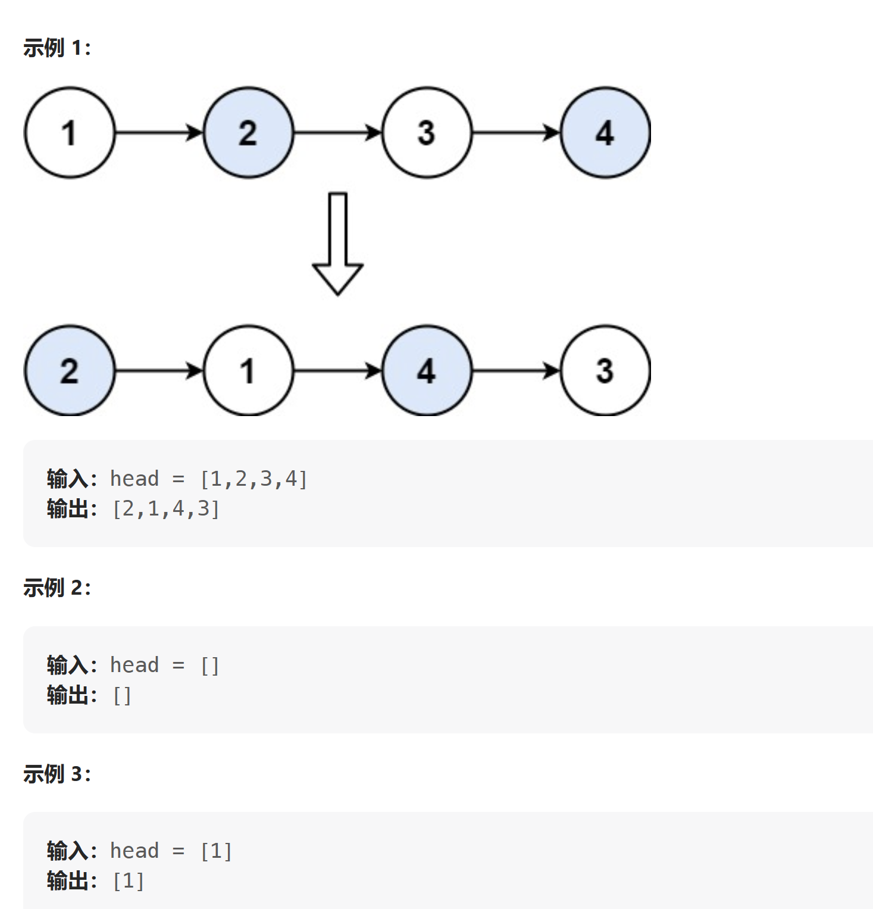

[LeetCode: 两两交换链表中的节点](https://leetcode.cn/problems/swap-nodes-in-pairs/description/)

给你一个链表，两两交换其中相邻的节点，并返回交换后链表的头节点。你必须在不修改节点内部的值的情况下完成本题（即，只能进行节点交换）。



---
解析：通过创建虚拟头节点来进行处理后续的交换操作，分成3不来进行操作 ：
即分别拆开3个指向下一个节点的指针，对其进行重定向操作既可以。

```cpp
ListNode* SwapNodes(ListNode* head)
{
    //以虚拟头节点的方式来进行交换操作
    ListNode* dummyNode = new ListNode(0);
    dummyNode->next = head;

    ListNode* curNode = dummyNode;
    while (curNode->next != nullptr && curNode->next->next !=nullptr)
    {
        ListNode* tmp1 = curNode->next; // 保留第二个节点的指针，后面回覆盖
        ListNode* tmp2 = curNode->next->next->next; //保留第三个节点的指针

        curNode->next = curNode->next->next;
        curNode->next->next = tmp1;
        tmp1->next = tmp2;

        curNode = curNode->next->next; //移动两个节点，进行下一次操作
    }


    ListNode* tmp = dummyNode->next;
    delete dummyNode;

    return tmp;

}

```


