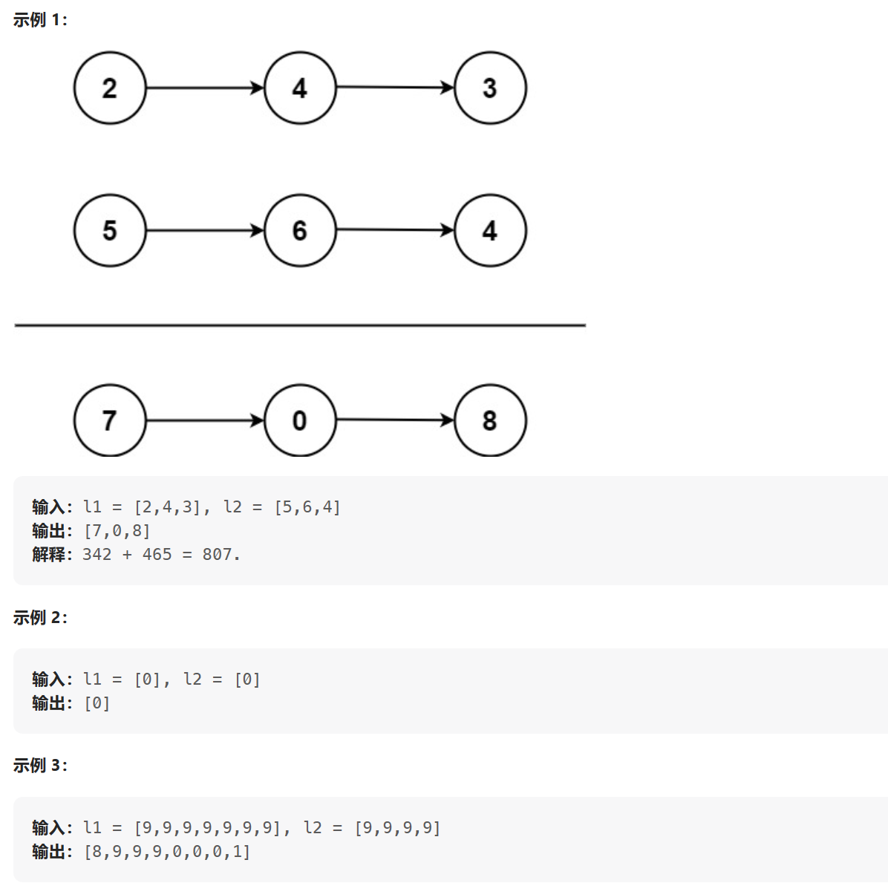

[LeetCode: 两数相加](https://leetcode.cn/problems/add-two-numbers/description/)

给你两个 非空 的链表，表示两个非负的整数。它们每位数字都是按照 逆序 的方式存储的，并且每个节点只能存储 一位 数字。

请你将两个数相加，并以相同形式返回一个表示和的链表。

你可以假设除了数字 0 之外，这两个数都不会以 0 开头。



----
解析：
由于链表的首节点为低位，尾节点为高位，所以两个链表所表示的数字相加，就相当于从首节点的值开始分别进行相加，会出现是否进位的情况。然后将相加的每一位存放在新的链表中。

```cpp
ListNode* addTwoNumbers(ListNode* l1, ListNode* l2) 
{
    ListNode* cur1 = l1;
    ListNode* cur2 = l2;

    // 创建头节点
    ListNode* head = new ListNode(0);
    int tmpNum = 0; //表示当前两个节点的和
    int flag = 0; // 0 表示无需进位， 1表示要向前进一位

    ListNode* tmp = head;

    //遍历两个链表，处理两个链表的数据，直到遇到任意一个链表结束
    while (cur1 != NULL && cur2 != NULL)
    {
        ListNode* newNode = new ListNode(0);

        tmpNum = cur1->val + cur2->val + flag;
        if (tmpNum / 10 == 0)
        {
            newNode->val = tmpNum;
            flag = 0;
        }
        else
        {
            newNode->val = tmpNum % 10;
            flag = 1;
        }

        tmp->next = newNode;
        tmp = tmp->next;

        cur1 = cur1->next;
        cur2 = cur2->next;

    }

    //确保 cur1 链表的长度不小于 cur2
    if (cur2 != NULL)
    {
        swap(cur1, cur2);
    }

    //继续处理长链表剩下的节点
    while (cur1 != NULL)
    {
        ListNode* newNode = new ListNode(0);
        tmpNum = cur1->val + flag; //该链表的节点值和进位标志的和

        if (tmpNum / 10 == 0)
        {
            newNode->val = tmpNum;
            flag = 0;
        }
        else
        {
            newNode->val = tmpNum % 10;
            flag = 1;
        }

        tmp->next = newNode;
        tmp = tmp->next;

        cur1 = cur1->next;
    }

    //遍历结束之后要检测是否有进位的情况
    if (flag)
    {
        ListNode* newNode = new ListNode(1);
        tmp->next = newNode;

    }

    return head->next;

}
```


