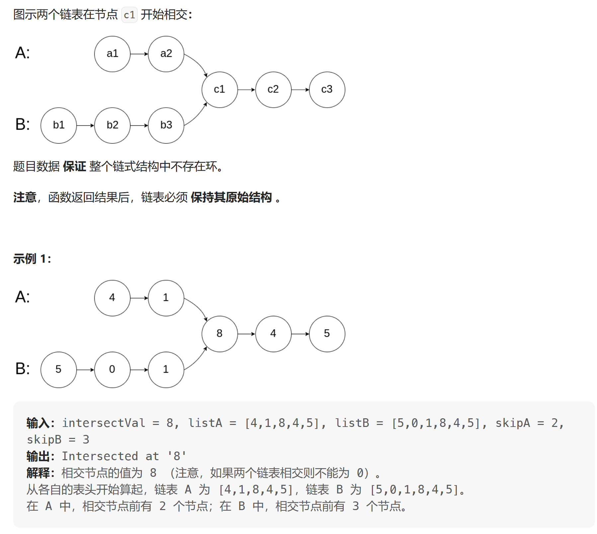
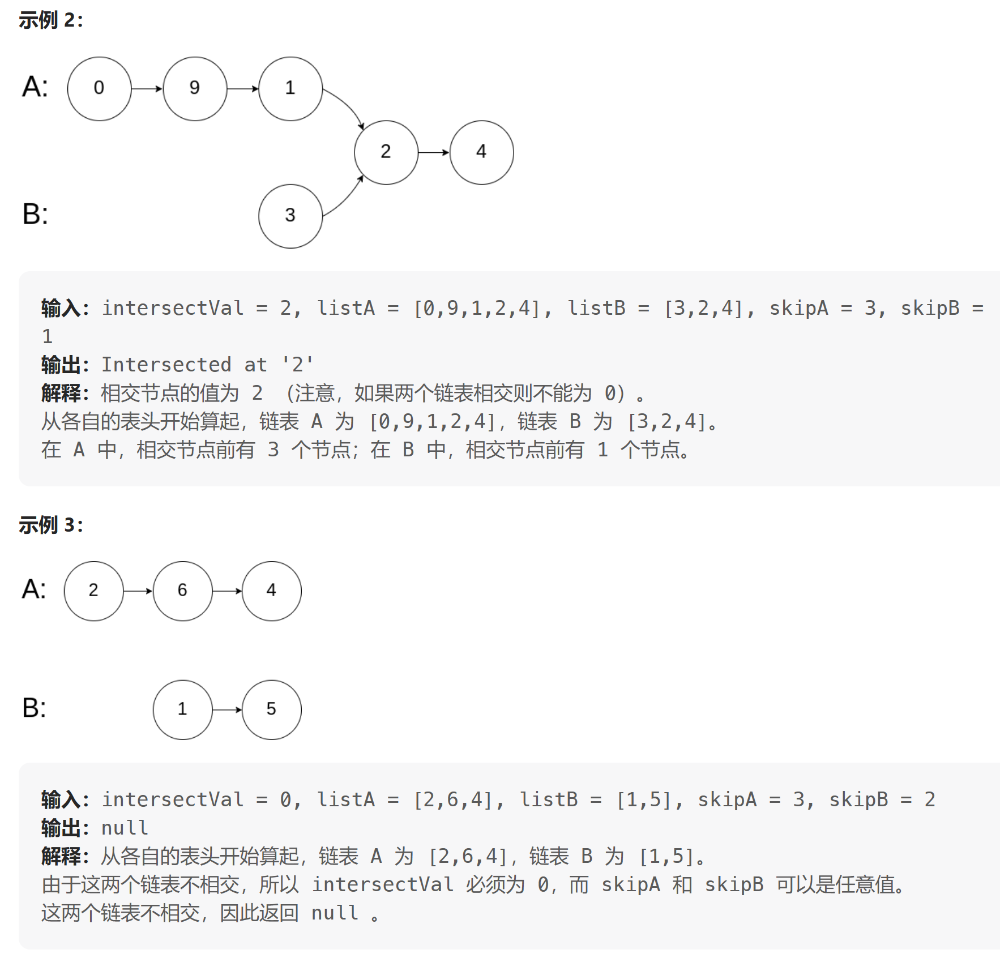

[面试题 02.07. 链表相交](https://leetcode.cn/problems/intersection-of-two-linked-lists-lcci/description/)

给你两个单链表的头节点 headA 和 headB ，请你找出并返回两个单链表相交的起始节点。如果两个链表没有交点，返回 null 。

**示例**




---
解析：
如题所示的两个链表若相交，则最后面的若干节点必定回重叠，相等，所以可以先求出两个链表的长度差值diff，
然后让长的链表先走diff步，其所在的位置必定与短的链表头节点空间相同(即两个链表当前位置后面的节点个数相等)，如下所示：
>1 - 2 - 3 - 4 - 8 - 9 - 10
&emsp; &emsp;&nbsp;         5 - 6 - 7 - 9 - 10

```cpp
ListNode* getIntersectionNode(ListNode* headA, ListNode* headB)
{
    if (headA == NULL || headB == NULL)
        return NULL;

    ListNode* curA = headA;
    ListNode* curB = headB;

    int cntA = 0;
    int cntB = 0;

    // 分别计算两个链表的长度
    while (curA != NULL)
    {
        cntA++;
        curA = curA->next;
    }

    while (curB != NULL)
    {
        cntB++;
        curB = curB->next;
    }

    // 根据计算的结果进行处理，保证curA>curB，否则进行互换，以便进行后续的统一处理
    curA = headA;
    curB = headB;
    if (cntB > cntA)
    {
        swap(cntA, cntB);
        swap(curA, curB);
    }

    // 计算两个链表之间的长度差，让长的先走到差值的位置，这样可以保证两个链表的末尾节点对齐
    // 然后比较分别比较两个链表的大小，找出是否有相交的起点
    int diff = cntA - cntB;
    while (diff>0)
    {
        curA = curA->next;
        diff--;
    }

    while (curA!=NULL && curB!=NULL)
    {
        if (curA == curB)
        {
            return curA;
        }
        else
        {
            curA = curA->next;
            curB = curB->next;
        }

    }

    return NULL;

}
```


